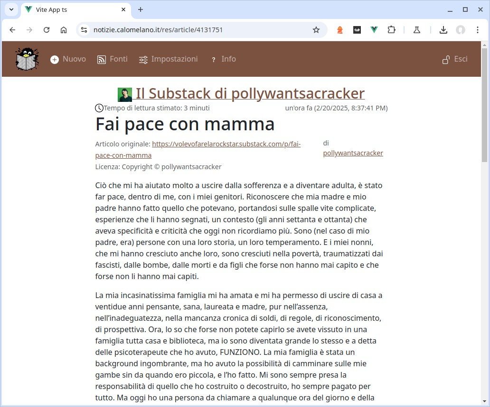
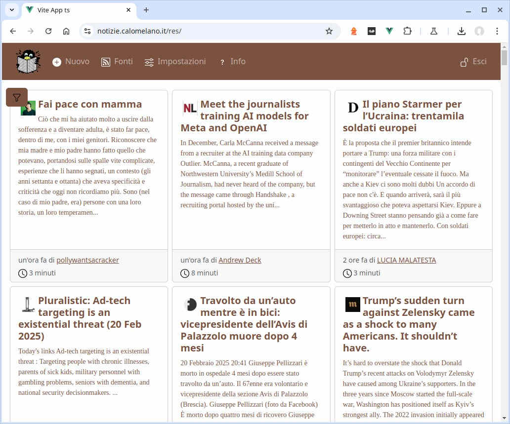

# flash

An open-source news platform with aggregation and ranking.

Second iteration born from the ashes of [**calo.news** ("An open-source news platform with aggregation, ranking and conversations")](https://gitlab.com/simevo/calo.news), sharing the same Postgres DB structure but:

- without PHP
- based on a modern Python web framework (Django and Django REST Framework) for the back-end
- using TypeScript and an up-to-date vite-based tooling for the Vue.js frontend
- and ready for deployment on a Kubernetes cluster.

[](https://github.com/cookiecutter/cookiecutter-django/)
[](https://github.com/astral-sh/ruff)

The aggregator presents to the anonymous visitor a restricted list of news items (only articles which some logged-in user has already read):


Clicking on an article opens an interstitial page:


which teases the user to log in to read the full text:



Logged in users also see more information on the home page (for example an extract of the article):



Anonymous pages are easy to recognize by the gray color of the header (after logging in the header color changes to "dark" [Mocha Mousse](https://www.pantone.com/eu/it/color-of-the-year/2025)), but they also differ because they are Server-side-rendered by Django, whereas the reserved pages are part of a client-rendered Single Page Application.

## Local development

Start flash:

    docker-compose -f docker-compose.local.yml up

Now you can:

- Open the **public UI** at: http://localhost:8100/ (initially the articles list will be empty: "_Non ci sono articoli da visualizzare_")

- Browse the database schema and tables with [Adminer](https://www.adminer.org/): [http://localhost:8090](http://localhost:8090/?pgsql=postgres&username=hkzQeWedcPCiuNYPdbPmXvjiLETCLaik&db=flash&ns=public) (use `c2lMdw3aiy5u3ykE9jHJDSO8gb7NxdtVKCO8YUxhywSQD9gofHB2qmpkmUxHVQqH` as password)

- Access the PostgreSQL database with `PGPASSWORD=c2lMdw3aiy5u3ykE9jHJDSO8gb7NxdtVKCO8YUxhywSQD9gofHB2qmpkmUxHVQqH psql -p 5433 -h localhost -U hkzQeWedcPCiuNYPdbPmXvjiLETCLaik flash`.

After signing in (use superuser account credentials, see below):

- Access the **reserved-access UI** at: http://localhost:8100/res/

- Access the full Django REST framework API at http://localhost:8100/api/

- Access the OpenApi-generated API docs at http://localhost:8100/api/docs/

- Open the Django administration Site: http://localhost:8100/admin/ and manage feeds from http://localhost:8100/admin/news/feeds/ (the feeds are pre-populated with the source 0 reserved for user-submitted articles, and 4 sample external sources: [RAI Televideo](https://www.servizitelevideo.rai.it/televideo/pub/index.jsp), [Il Post](https://www.ilpost.it), [Unicorn Riot](https://www.unicornriot.ninja) and [Al Jazeera](https://www.aljazeera.com/)).

Initially also the articles list in the the reserved-access UI will be empty, but at the 4th minute of the hour the sources will be polled and the first articles will start to appear there.

If you are eager to start the polling earlier, you can change the minute and/or the frequency in `config/celery_app.py`. If on the other hand you do not want to run the polling and the other auxiliary services, start the docker compose specifying to start just the `flash` service and its dependencies:

    docker-compose -f docker-compose.local.yml up flash

Finally once some articles have been read in the reserved-access UI, they will show up in the public UI.

## Settings

Moved to [settings](https://cookiecutter-django.readthedocs.io/en/latest/1-getting-started/settings.html).

## Basic Commands

### Setting Up Your Users

- To create a **normal user account**, just go to Sign Up and fill out the form. Once you submit it, you'll see a "Verify Your E-mail Address" page. Go to your console to see a simulated email verification message. Copy the link into your browser. Now the user's email should be verified and ready to go.

- To create a **superuser account**, use this command:

        $ docker-compose -f docker-compose.local.yml exec django /entrypoint python3 manage.py createsuperuser --email root@example.com --username root

For convenience, you can keep your normal user logged in on Chrome and your superuser logged in on Firefox (or similar), so that you can see how the site behaves for both kinds of users.

### Type checks

Running type checks with mypy:

    $ mypy flash

### Test coverage

To run the tests, check your test coverage, and generate an HTML coverage report:

    $ coverage run -m pytest
    $ coverage html
    $ open htmlcov/index.html

#### Running tests with pytest

    $ pytest

### Live reloading and Sass CSS compilation

Moved to [Live reloading and SASS compilation](https://cookiecutter-django.readthedocs.io/en/latest/2-local-development/developing-locally.html#using-webpack-or-gulp).

### Celery

This app comes with Celery.

To run a celery worker:

```bash
cd flash
celery -A config.celery_app worker -l info
```

Please note: For Celery's import magic to work, it is important _where_ the celery commands are run. If you are in the same folder with _manage.py_, you should be right.

To run [periodic tasks](https://docs.celeryq.dev/en/stable/userguide/periodic-tasks.html), you'll need to start the celery beat scheduler service. You can start it as a standalone process:

```bash
cd flash
celery -A config.celery_app beat
```

or you can embed the beat service inside a worker with the `-B` option (not recommended for production use):

```bash
cd flash
celery -A config.celery_app worker -B -l info
```

## Deployment

The following details how to deploy this application.

### Docker

See detailed [cookiecutter-django Docker documentation](https://cookiecutter-django.readthedocs.io/en/latest/3-deployment/deployment-with-docker.html).

## Updating JavaScript dependencies

JS and CSS dependencies are managed with `yarnpkg` and the files are put in place with `make` then checked into the repo.

In this way the files are vendored and the repo is self-sufficient, but it's easy to upgrade them and add new dependencies.

To **upgrade** the dependencies:

    yarnpkg upgrade

then reinstall them:

    make

To **add a new dependency**, install it with `yarnpkg add ...` or `yarnpkg add -D ...`, update the `Makefile` to put in place the files you need and `git add ...` them.

Dont't forget to commit your changes!

## Database schema

The Entity-Relationship diagram of the main tables and their relationships is:


The two main tables are `feeds` and `articles`. Each of them has a supplementary table for expensive-to-compute values (`feeds_data` and `articles_data` respectively) which are "manual", pseudo materialized views, selectively refreshed by triggers that react on the input data processed by the `feeds_data_view` and `articles_data_view` (not shown on the diagram).

Many articles can be aggregated from a single feed, therefore the two tables are linked by a one-to-many relationship from `feed.id` to `articles.feed_id`.

Feeds can be rated by users, whereas articles can be rated, read and dismissed. These user - feed/article many-to-many relationships are stored through the `news_userfeeds` and `news_userarticles` tables.

Additionally users can bookmark articles in separate lists, or get different automatic newsfeeds. To flexibly handle all these different lists, the lists metadata are stored in the `news_userarticleslists` table with a one-to-many relationship from `users_user.id` to `news_userarticleslists.user_id`. The actual article lists (which are many-to-many relationships between the `articles` and the `news_userarticleslists` tables) are stored though the `news_userarticles` table.

## License

**flash** an open-source news platform with aggregation and ranking

Copyright (C) 2017-2025 Paolo Greppi

This program is free software: you can redistribute it and/or modify
it under the terms of the GNU Affero General Public License as published by
the Free Software Foundation, either version 3 of the License, or
(at your option) any later version.

This program is distributed in the hope that it will be useful,
but WITHOUT ANY WARRANTY; without even the implied warranty of
MERCHANTABILITY or FITNESS FOR A PARTICULAR PURPOSE.  See the
GNU Affero General Public License for more details.

You should have received a copy of the GNU Affero General Public License
along with this program (file [LICENSE](/LICENSE)).
If not, see <https://www.gnu.org/licenses/>.
