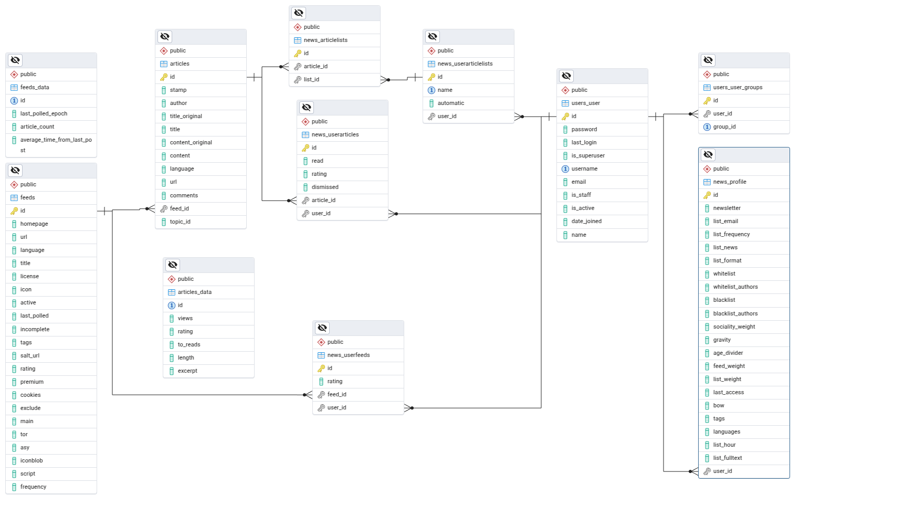

## Database schema

The Entity-Relationship diagram of the main tables and their relationships is:

The two main tables are `feeds` and `articles`. Each of them has a supplementary table for expensive-to-compute values (`feeds_data` and `articles_data` respectively) which are "manual", pseudo materialized views, selectively refreshed by triggers that react on the input data processed by the `feeds_data_view` and `articles_data_view` (not shown on the diagram).

Many articles can be aggregated from a single feed, therefore the two tables are linked by a one-to-many relationship from `feed.id` to `articles.feed_id`.

Feeds can be rated by users, whereas articles can be rated, read and dismissed. These user - feed/article many-to-many relationships are stored through the `news_userfeeds` and `news_userarticles` tables.

Additionally users can bookmark articles in separate lists, or get different automatic newsfeeds. To flexibly handle all these different lists, the lists metadata are stored in the `news_userarticleslists` table with a one-to-many relationship from `users_user.id` to `news_userarticleslists.user_id`. The actual article lists (which are many-to-many relationships between the `articles` and the `news_userarticleslists` tables) are stored though the `news_userarticles` table.

## Overall Project Architecture

This section describes the overall architecture of the Flash project, including the backend (Django), frontend (Vue.js), and other services. 
*(TODO: Expand this section with more details on the interaction between components, APIs, and data flow.)*
