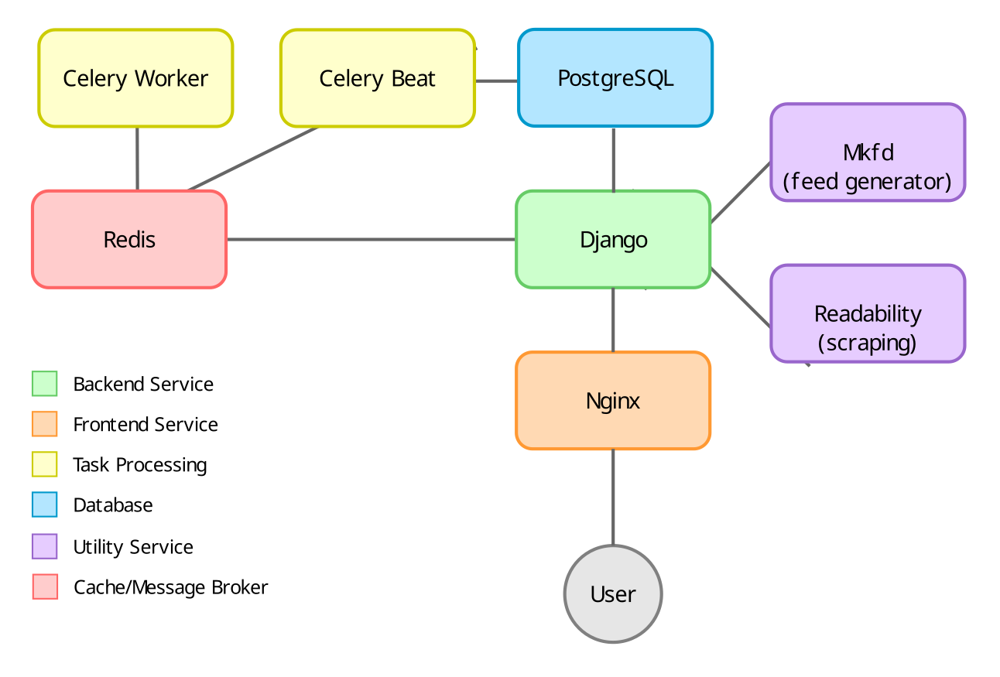

flash - Architecture Overview
=============================

## Overall Project Architecture

This section describes the overall architecture of the Flash project, including the backend (Django), frontend (Vue.js), and other services. 

The architecture is the classical **three-tier** architecture for webapps:

1. The **back-end** service is implemented in the Python 3.12 language as an "API only" [Django](https://www.djangoproject.com/) project based on [Django REST framework (DRF)](https://www.django-rest-framework.org/); there are no app forms/visual interfaces except the admin interface and the API playground provided by DRF.

2. The **front-end** service executes the nginx web server which serves a bundle of static, "compiled" HTML5 / CSS /JavaScript file produced with the [vite](https://vite.dev/) build tool from TypeScript sources making use of:

   - the [Bootstrap CSS framework](https://getbootstrap.com/) version 5.3

   - and [Vue.js front end JavaScript framework](https://vuejs.org/) version 3;

   Additionally nginx proxies the backend API as `/api`. In development mode nginx also proxies the vite development server.

3. Asynchronous **task processing** is based on the [Celery](https://docs.celeryq.dev/en/stable/index.html) distributed task queue, and takes care os slow tasks such as feed polling and calculating vector embeddings.

4. The **data-base** service executes the PostgreSql relational database, with the [pgvector](https://github.com/pgvector/pgvector) vector similarity extension.

5. The **readability** service runs [Readability.js](https://github.com/mozilla/readability) (a standalone version of the readability library used for Firefox Reader View) as a service, to retrieve the full text of articles for those feeds which do not include it in the RSS.

6. The **mkfd** runs the [mkfd](https://github.com/TBosak/mkfd) RSS feed builder as a service, for those feeds that do not offer an RSS feed. See ["Adding a scraped RSS feed"](./ADMIN.md) in the Admin Guide.

This architecture allows us to get the best out of Django (for the database interface, data types and API structure), while keeping the app UI reactive and fast.

## Database schema

The Entity-Relationship diagram of the main tables and their relationships is:

The two main tables are `feeds` and `articles`. Each of them has a supplementary table for expensive-to-compute values (`feeds_data` and `articles_data` respectively) which are "manual", pseudo materialized views, selectively refreshed by triggers that react on the input data processed by the `feeds_data_view` and `articles_data_view` (not shown on the diagram).

Many articles can be aggregated from a single feed, therefore the two tables are linked by a one-to-many relationship from `feed.id` to `articles.feed_id`.

Feeds can be rated by users, whereas articles can be rated, read and dismissed. These user - feed/article many-to-many relationships are stored through the `news_userfeeds` and `news_userarticles` tables.

Additionally users can bookmark articles in separate lists, or get different automatic newsfeeds. To flexibly handle all these different lists, the lists metadata are stored in the `news_userarticleslists` table with a one-to-many relationship from `users_user.id` to `news_userarticleslists.user_id`. The actual article lists (which are many-to-many relationships between the `articles` and the `news_userarticleslists` tables) are stored though the `news_userarticles` table.
