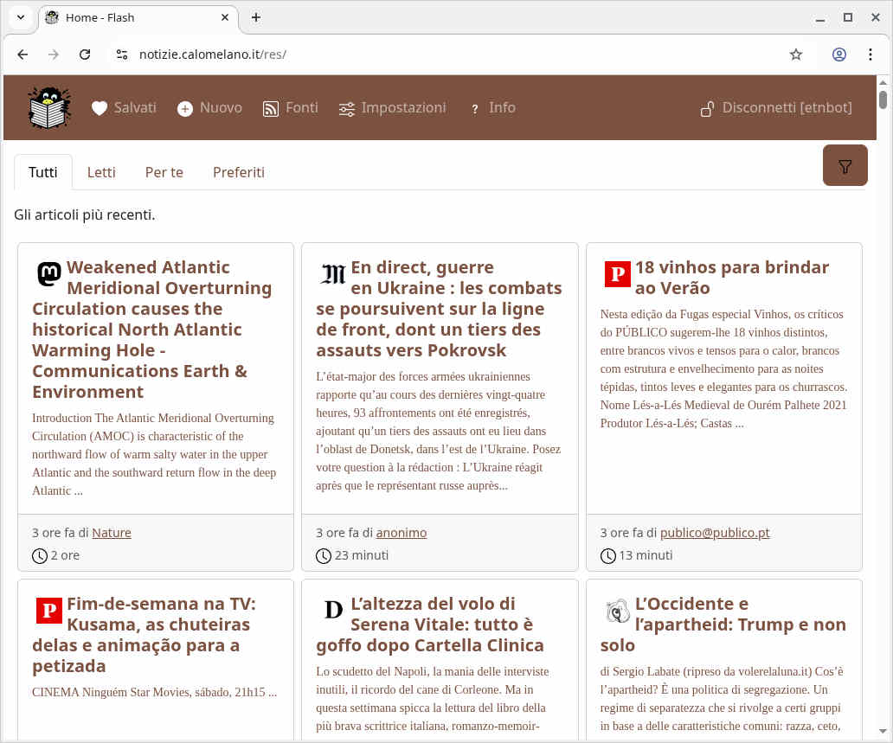

flash - User Guide
==================

## Basic usage

Flash offers two distinct experiences depending on whether you are logged in as a user or not ("guest").

Guest pages are easy to recognize by the gray color of the header:

After logging in, the header color changes to "dark" ([Mocha Mousse](https://www.pantone.com/eu/it/color-of-the-year/2025)):

### Guest visitor

The aggregator presents to the guest visitor a restricted list of news items (only articles which some logged-in user has already read):

Clicking on an article opens an interstitial page:

which teases the user to log in to read the full text.

### Logged-in user

Once logged in, users are presented with a different layout.

The homepage features a tabbed layout for navigating different article views:

The available views are:

- **Tutti** (All Articles): Shows all available articles, paginated and filtered (by language, date, length and full-text search).
- **Letti** (Read Articles): Displays articles that you or others have previously read, paginated.
- **Per te** (Personalized Newsfeed): Your algorithmic newsfeed, tailored to your preferences and feed ratings (see Feature 5).
- **Preferiti** (Favorites): Shows articles from your preferred feeds, paginated.

Articles within these tabbed views are displayed as cards, showing:

- The feed's logo (linking to the feed's page/source).
- The article title. If the article has been translated, both original and translated titles might be shown.
- A short excerpt of the article content.
- The author's name (linking to a page showing other articles by the same author).
- The publication time, displayed as a relative time (e.g., "2 hours ago").
- An estimated reading time for the article.

The all articles, read and favorites lists are paginated, and you can load more articles using a "Load more articles" button. 

Clickin on any article leads to the article detail page:

which shows the full text (if available), the optional translation, and the related articles.

## Features

1. **Filtering** – from the main article list (e.g., "Tutti") on the homepage, click on the "filter" button (a floating button with a funnel icon, located on the right side of the screen) to expand an off-canvas sidebar. This sidebar offers several client-side filtering criteria: by language, date, and length. As the filtering criteria are changed, the article list is updated in (almost) real time. Full-text search is also available and is server-side: once you enter two or more keywords, while you wait for the refreshed data to be loaded from the backend a spinner is shown with a reminder that the current list is filtered. All filtering settings are persisted on the device, meaning if you use Flash from two devices, you may see different newsfeeds based on your local filter settings.

2. **Sharing** on social media – from the article detail page, click on the “share” icon and open the link to the article in your favorite social network (Bluesky, Facebook, Linkedin, Mastodon, Reddit, Telegram, Twitter and Whatsapp). For Mastodon, the first time you share an article you will be prompted to selectypur instance (this setting is saved n the device). Finally, you also have the option "Copy link to clipboard" for sharing on other apps like SMS and email.

3. Saving articles to **lists** – you can create one or more lists then save articles for reading later, bookmarking and exporting. These are managed from the “Saved articles” (heart icon) page.

4. Articles **similarity**: the title and content of each article are used to compute the similarity. This makes it possible to suggest related articles (these are shown below the contents in the articles detail page) and to generate a personalized newsfeed (see next item).

5. **Algorithmic newsfeed** – the "Per te" (Personalized Newsfeed) tab of the homepage displays an article list automatically updated every hour by an algorithm based on your preferences. The newsfeed personalization options are set from the “Settings” page: languages and whitelisted / blacklisted keywords. The algorithm is based on the similarity between the article and the whitelisted words.

6. **Preferred Feeds** – the "Preferiti" (Favorites) tab of the homepage displays articles from feeds which have been marked with as favorites (heart icon) in the "Feeds" page.

7. **Excluded Feeds** – feeds which have been marked with as hidden (slashed eye icon) in the "Feeds" page are never shown in the main article list (e.g., "Tutti") on the homepage.

8. Exporting lists as **RSS** feeds – all lists (including the automatic newsfeed) can be exported as anonymized and public RSS feeds (accessible without authentication) so that they can be consumed by other news aggregators or published automatically elsewhere: just click on the button with the RSS icon to copy the link to the clipboard. This feature can be used to create element / matrix rooms for each topic, where a "Feed Rss" bot publishes the relevant article links to bootstrap conversations.

9. **TTS** (text-to-speech) – the Flash platform can read aloud single articles or all the articles in a (manual or automatic) article list, using the local voices on your device. This could be useful for accessibility or to create a kind of "synthetic podcast". While the article(s) are read, a light gray background shows the progress. A tiny, green, floating toolbar at the bottom makes it possible to pause, skip forward and backward and stop altogether the reading. Note: for this to work you need to install local voices (it does not work well with "cloud" voices), and disable the automatic screen locking (otherwise the reading stops abruptly when the screen locks).

10. Automatic **translations** – from the article detail page, logged-in users have access to a "Translate" button which requests the translations for the title and content from a service in the cloud (currently Microsoft Translator). The spinner starts spinning, then after a few seconds if the request succeeds, the article reappears, this time the text in the original language is shown side-by-side with the translation in Italian (or, on narrow displays, one after the other). The feature is available only for articles in a language different from the instance base language, which for the currently only live instance notizie.calomelano.it is Italian.

10. **Dowloading** articles – single articles or all the articles in a (manual or automatic) article list can be exported to HTML, PDF (in A5 page size) and EPUB formats. This is useful to send a copy to a friend or to catch up with those long form articles on your ebook reader.

12. **Mastodon Bot** – Flash can automatically post new articles from a user's newsfeed to a specified Mastodon account. To enable this feature for a user:

    * Navigate to the user's Profile in the Django admin interface.
    * Check the `Is bot user` flag.
    * Enter the name of the user articles list that should get published. If you want to publish the "For you" automatic newsfeed, set it to `newsfeed`.
    * Fill in the Mastodon API credentials (in Mastodon, go to your Account Preferences -> Development -> New Application, create a new application, fill in Name and Website, with `read`, `profile` and `write:statuses` scopes):
      * `Mastodon client id`
      * `Mastodon client secret`
      * `Mastodon access token`
      * `Mastodon API base url` (e.g., `https://mastodon.social` or your instance's URL)

    Bot Functionality:

    * The bot runs automatically every hour.
    * It scans the selected article list of the configured bot user for new (unread) articles.
    * New articles found are posted to the Mastodon account associated with the provided credentials.
    * After successfully posting an article, it is marked as 'read' for the bot user to prevent reposting.
    * To avoid spamming, the bot will post a maximum of 5 articles per hour.

13. **OPML export**: Export the [OPML (Outline Processor Markup Language)](https://en.wikipedia.org/wiki/OPML) file containing the list of aggregated feeds from the public URL `/api/feeds/opml/`. This file can be imported into other RSS readers or aggregators.
